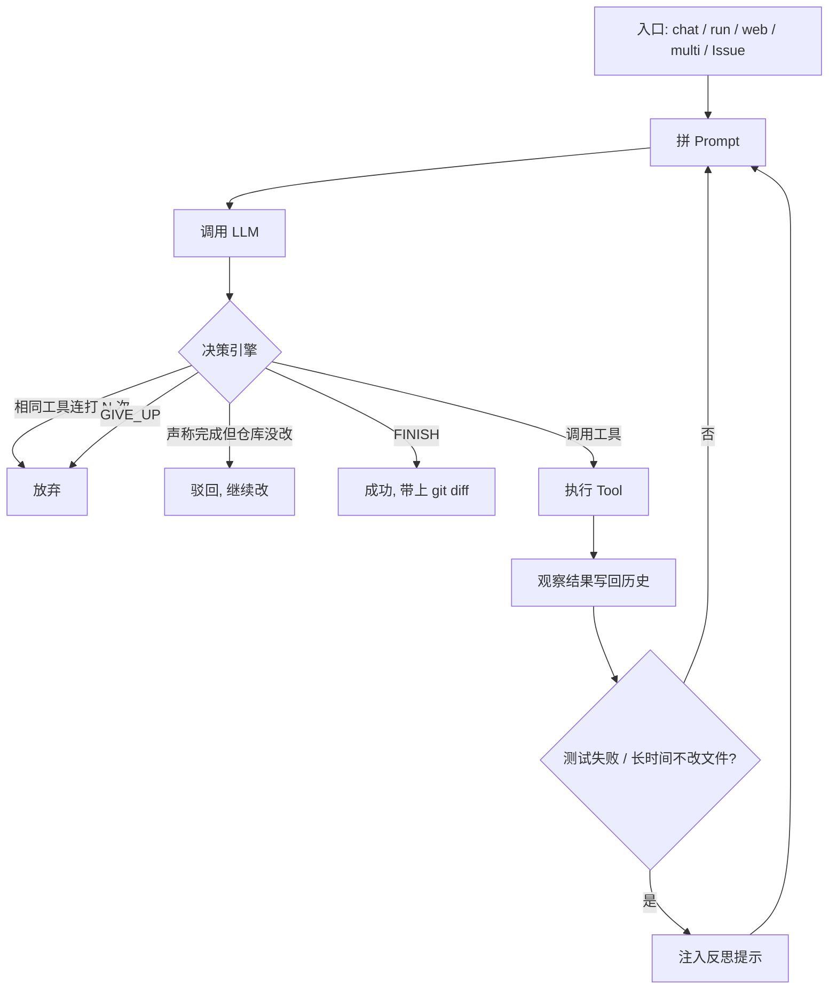

# Coding Agent 功能说明

这是一个**自主编程 Agent**：用自然语言描述任务，它会自己探索仓库、读写文件、跑测试、提交改动，直到任务完成或达到步数上限。

设计参考了 SWE-agent、Aider、OpenHands，核心是 **ReAct**（推理 → 调用工具 → 观察结果 → 再推理）。同一套工具和策略有两套引擎：手写循环（默认）和可选的 LangGraph 状态机。

支持的模型：**Claude、DeepSeek、OpenAI、Groq、Ollama、vLLM** 等。本地可用 Ollama / vLLM，不必走云端。

---

## 1. 能做什么（使用视角）

| 场景 | 怎么用 | 说明 |
| --- | --- | --- |
| 多轮改代码 | `agent chat` | 最接近 Claude Code：跨轮保留对话，边聊边改 |
| 一次性任务 | `agent run --task "..."` | 适合批处理、脚本化 |
| 浏览器里聊 | `agent web` | 本地页面 + SSE 流式输出 |
| HTTP API | `agent serve` | FastAPI，给前端或其他服务调用 |
| 接到 Cursor / Claude Desktop | `agent mcp` | 把本仓库的工具暴露成 MCP |
| 多角色协作 | `agent multi --topology …` | 规划 / 编码 / 审查，或辩论后再写 |
| GitHub Issue 自动修 | `python -m entry.github_issue` | 拉 Issue → 跑 Agent → 开分支 → 提 PR |
| 评测对比 | `agent eval` + `python -m eval.compare` | 独立验证，不信模型自己说的「做完了」 |

对话里可用：`/exit`、`/stats`、`/clear`、`/help`。

---

## 2. 它怎么干活

每一轮都是同一件事：拼上下文 → 模型决定一步动作 → 执行工具或结束。



**决策引擎**（不只是「模型说停就停」）：

- 连续相同动作 → 判循环，直接放弃
- 要求必须改过文件才能 `finish` 时，干净 git 上的「我做完了」会被驳回
- pytest 失败、连续多步不改文件 → 插入反思提示，逼模型换思路

**结构化计划**：`plan` 工具维护编号清单，下一步的系统提示里能看到还剩哪些步骤。

默认每轮最多约 **40 步**，token 预算约 **80k**（超了会裁历史，**不会**因为 token 用尽而强制停）。

---

## 3. 上下文：它「看见」什么

系统提示按固定顺序拼，避免把整仓塞进窗口：

1. **仓库地图（repo-map）** — tree-sitter 抽符号，再按**当前任务**给文件打相关分（路径匹配权重高于符号名），先相关、再结构重要性  
2. **项目规则** — `AGENTS.md`、`CLAUDE.md`、`.cursor/rules`、`.agent/rules`（始终生效的规范）  
3. **Skills 目录** — 命名 SOP 的一行目录；对得上再 `skill` 加载全文  
4. **RAG** — 按任务检索代码片段（可选，默认关）  
5. **长期记忆** — 已批准的短事实，不是整段聊天记录  
6. **短期窗口** — 本会话最近若干条用户问题 + 碰过的文件  
7. **当前计划** — `plan` 里还没做完的步骤  
8. **可用工具列表**

另外还有：对话历史按 token 预算从旧到新裁；过长时可 **compaction**（中间轮次收成摘要）；任务可 **checkpoint** 后从某步恢复。

### 检索怎么分层

| 层 | 回答的问题 | 典型工具 |
| --- | --- | --- |
| 精确查找 | 哪一行 / 哪个文件含这个字符串 | `search_text`、`find_files` |
| 符号索引 | `foo` 定义在哪（建一次，之后近似 O(1)） | `find_symbol` |
| 仓库地图 | 这个仓大概有什么 | 注入系统提示，不必每次全读 |
| RAG | 和这句话语义相关的代码 | 语法分块 + 稠密向量 + BM25，RRF 融合，可选 MMR / cross-encoder 重排 |

RAG 还支持仓外文档、增量缓存、recall@k / MRR / 延迟评测。缺 numpy 时相关测试会跳过，主循环不受影响。

---

## 4. 工具：它能动手做什么

| 类别 | 能力 |
| --- | --- |
| 文件 | 读、按行看、写、补丁式编辑；快照 **undo**（不依赖 git） |
| 搜索 | 文本搜索、按名找文件、符号定位 |
| Shell | 真实命令；四层防护（见下） |
| 测试 | `pytest`，结构化失败摘要（用当前解释器，避免 PATH 上没有 `python`） |
| Git | status / diff / add / commit |
| 计划 | 创建 / 完成编号步骤 |
| Skill | 加载命名 SOP（`SKILL.md`） |
| 网页 | `web_fetch`：只允许 http(s)，抽出标题和正文；可选 Playwright 渲染 JS |
| 记忆 | `remember` / `recall`（开启 `--memory` 时） |

**Skill / MCP / Tool 三层**（把平台 SOP 接进来时用同一套）：

- **Tool**：Python 里的 `BaseTool`（改文件、搜代码、拉网页……）  
- **MCP**：`agent mcp` 把同一套注册表暴露给 Cursor / Claude Desktop  
- **Skill**：告诉模型**何时、按什么流程**去调这些工具  

样例 SOP：`examples/skills/alert-triage/`，拷到目标仓的 `.agent/skills/` 即可。本仓库**没有**伪造风控业务 API。

---

## 5. 记忆（ChatGPT / Claude 那套，不是把聊天整段塞进 prompt）

窗口滑出 prompt **不等于删除**。完整对话留在 `stm_turns`；偏好等短事实会被抽出来；溢出时再归档可检索片段。注入仍然只放 top-k，不会把历史一股脑丢进 system prompt。

| 层 | 是什么 |
| --- | --- |
| 线程 / 短期 | 当前对话最近 n 条用户问题（进 prompt 的窗口） |
| 聊天历史 | 更早的轮次仍保存在库里，按需检索片段 |
| 规则 | 你写进仓库、始终生效的规范 |
| Skills | 按需加载的 SOP |
| 记忆 | 抽取出的短事实（偏好、身份、项目约定）；可 `remember` / 待审批 |
| 代码索引 | RAG，按内容哈希增量更新，不当成对话记忆 |

---

## 6. 多 Agent 与闭环

`agent multi` 拓扑：

| 拓扑 | 角色 |
| --- | --- |
| `pipeline`（默认） | 规划（只读）→ 编码 ⟲ 审查 |
| `pair` | 编码 ⟲ 审查（跳过规划） |
| `debate` | 两个规划方案 → 编码 ⟲ 审查 |
| `autonomous` | 单 Agent，清单靠 `plan` 工具 |

规划 / 审查只有只读工具（含 `plan`、`skill`、`web_fetch`）；**只有编码角色能改文件、跑 shell**。角色之间用 **scratchpad** 传摘要，不合并整段 EventLog。

**闭环**（`ClosedLoop`）：工单（本地或 GitHub Issue）→ 跑 Agent → 可选再用命令独立验收 → 可选把教训写入长期记忆。Issue → 分支 → PR 是其中一条业务路径。

---

## 7. 安全

Shell 四层，不是「模型保证小心」：

1. **硬拦截** — `rm -rf /`、`mkfs` 等永不执行  
2. **只读白名单** — `ls`、`grep`、`git status`、`pytest` 等直接跑  
3. **写操作确认** — `--confirm` 或 chat 下，`git commit`、`pip install` 等要你点头；带 `>` 重定向也会确认  
4. **Docker 沙箱** — `--sandbox` 时命令进容器，仓库挂载同步，默认无外网  

`web_fetch` 只接受 http/https，并限制体积和超时。

---

## 8. 模型路由与成本

可以不只绑一个模型：

- **难度路由**：调用前根据任务关键词等估难度，便宜模型干简单步、贵模型干难步  
- **置信度级联**：先便宜模型，不确定再升级  
- 本地：`provider: ollama` 或 `vllm`（默认 `http://localhost:8000/v1`）  
- 可用 Docker Compose 起 Postgres + Redis + `agent serve`（见 [DOCKER.md](DOCKER.md)）

---

## 9. 评测（Harness）

循环是：**写清任务 → Agent 改代码 → 独立验证 → 对比两次运行**。不采信模型自己的 `FINISH`。

| 类型 | 指标 |
| --- | --- |
| 结果 | pass@1 / pass@k、步数、token、估算费用、LLM 时间 vs 工具时间 |
| 过程 | 工具错误率、连续重复动作、反思次数、到第一次编辑的时间 |
| 检索 | recall@k、MRR、hit@k、延迟 |

数据集：内置小任务套件、HumanEval、SWE-bench Lite。具体数字随模型和当次运行变化，用 `agent eval` / `python -m benchmarks.run_swebench` 自己跑，文档里不编造 pass@k。

---

## 10. 常用命令

```bash
agent chat [--repo PATH] [--model MODEL] [--sandbox]
agent run --task "修好失败的测试" [--confirm] [--sandbox]
agent multi --task "..." --topology pipeline|pair|debate|autonomous
agent eval --engine native --output native.json
python -m eval.compare --labels native,langgraph native.json langgraph.json
agent mcp --repo .
agent serve --repo .          # 或 docker compose up --build，见 docs/DOCKER.md
agent web --repo .
python -m entry.github_issue -r owner/repo -i 42 -l /tmp/myrepo
```

配置文件：`config/default.yaml`（provider、api_key、步数、token 预算等）。完整用法见 [USAGE.md](../USAGE.md)。

---

## 11. 明确没做的事

- 没有做成某个风控 / 研判 SaaS，也没有假平台 API  
- 前端是标准库 SSE 页面，不是 React / React Native  
- Playwright 是可选依赖；默认 `web_fetch` 是静态 GET  
- 没有完整 A2A 协议实现（多角色 + scratchpad 是协作形态）  
- 没有微调训练流水线；本地推理走 Ollama / vLLM  

---

## 12. 测试

本机一次完整运行（2026-08-20，未装 RAG/LangGraph extra、未开 Docker）：

**572 passed，11 skipped。**

清单、extras、如何复现计数：[TESTING.md](TESTING.md)。

---

## 13. 相关文档（英文细节）

| 文档 | 内容 |
| --- | --- |
| [Coding Agent.md](Coding%20Agent.md) | 架构与循环逐步说明 |
| [MEMORY.md](MEMORY.md) | 规则 / 记忆 / 短期窗口 |
| [SKILLS.md](SKILLS.md) | SOP → Skill |
| [HARNESS.md](HARNESS.md) | 评测与闭环 |
| [rag.md](rag.md) | 混合检索与指标 |
| [SEARCH_AND_INDEX.md](SEARCH_AND_INDEX.md) | 符号索引与查找分层 |
| [MULTI_ROUTER.md](MULTI_ROUTER.md) | 多模型路由 |
| [TESTING.md](TESTING.md) | 测试清单 |
